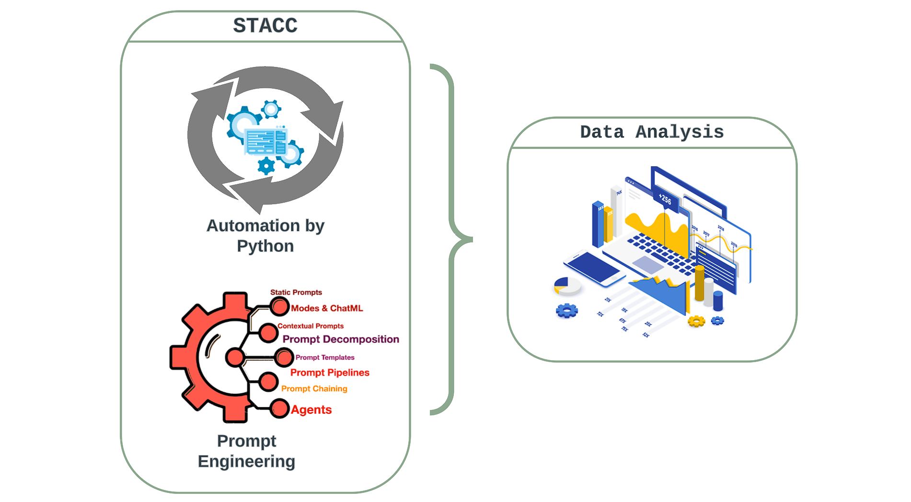
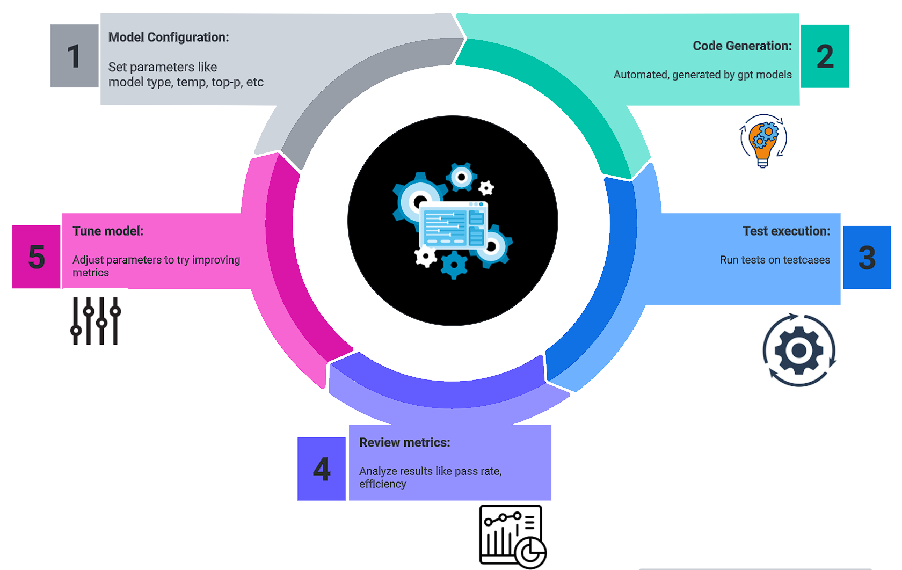
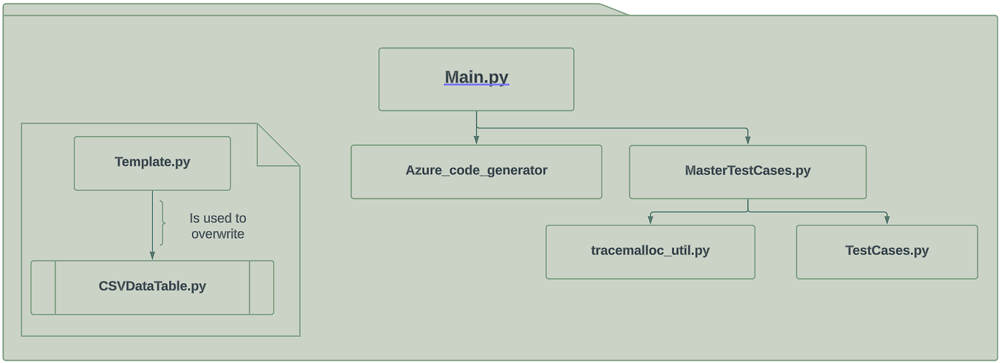
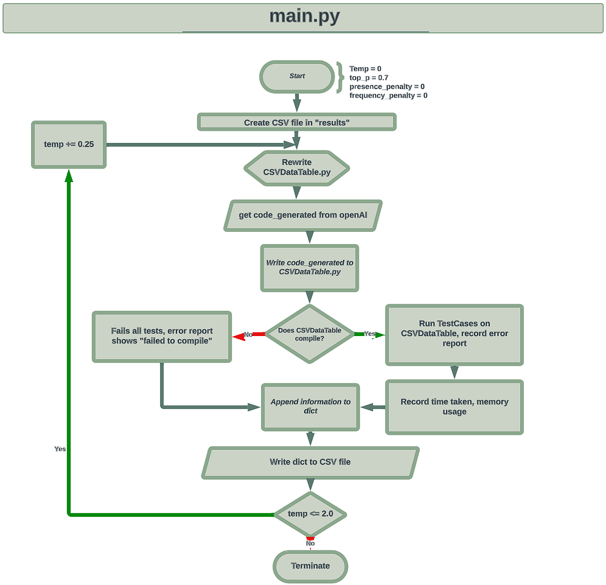

# STACC — Systematic Testing of Automated Code Completion for Database Systems
[](https://www.python.org/downloads/release/python-390/)
[](https://www.python.org/downloads/release/python-390/)
[](https://its.hku.hk/services-main/)





## Table of Contents

- [Introduction](#introduction)
- [Structure](#structure)
- [Usage](#usage)
  - [Running the File with Bash](#running-the-file-with-bash)
  - [Setup](#setup)
  - [Output](#output)
- [Authors](#authors)
- [Acknowledgements](#acknowledgements)
- [Miscellaneous](#miscellaneous)
  - [More about the homework assignment](#more-about-the-homework-assignment)


## Introduction

This project evaluates the ability of AI systems like GPT-3 and GPT-4 to generate Python code for accessing and manipulating relational databases. Test cases from a database-related homework assignment are used to benchmark performance.

The project prompts the AI systems to generate Python code implementing the test case functionality. To enhance the quality of generated code, prompt engineering techniques are employed; the prompt is carefully tuned to encourage the generation of code that meets the desired specifications.

The code is evaluated on metrics including execution time, memory usage, and test case pass rate to benchmark performance across models and configurations. By comparing results across AI systems and hyperparameter configurations, the goal is to benchmark performance and identify areas for improvement. 

The output CSV file contains metrics that can be analyzed to understand strengths, weaknesses, and evolution of leading models in producing valid Python code to access and manipulate relational data. The goal is to understand and advance the capabilities of leading AI systems for automated programming tasks involving relational databases with predefined schemas.

## Structure  

```
PROJECT FOLDER
├── data
│   └── baseballdatabank-2019.2 # Raw input CSV baseball data  
│   ├── README.txt
│   └── core
│       └── [all of the data]
├── results # Output results CSV file
├── src
│   ├── __init__.py # Makes src a Python package
│   ├── azure_code_generator.py # Generates code via OpenAI API
│   ├── main.py # Orchestrates workflow and evaluation
│   ├── MasterTestCases.py # Runs test cases
│   ├── TestCases.py # Contains individual test cases  
│   ├── template.py # Template for generated code
│   ├── tracemalloc_utils.py # Memory usage utils
│   └── CSVDataTable.py # Scaffold for generated code
├──  images  #  a folder of the images in the readme
└── README.md # Documentation
```

## Usage
The current test runs iterate through temperature values from 0.0 to 2.0 in increments of 0.25. To modify the temperature range, update the `temperature` and `increment` variables and the while loop in `main.py`. You can change the start, stop, and increment values as needed.

Modify test cases:
- Edit `TestCases.py` and add/update test methods
- Each test validates expected behavior
- Improves coverage of corner cases

Change hyperparameters:
- Edit variables initialized in `main.py`
- Like `temperature`, `top_p`, etc

Switch model:
- In `main.py` change `model` variable
- Options: "chatgpt", "chatgpt-4", "chatgpt-4-32k"

Customize prompt:
- Edit prompt in `main.py`
- Tune prompt to improve code quality

Run evaluation:
- `python main.py` executes full workflow but you need to manipulate the values in `main.py` if you want
- Alternatively, run the bash file `run.sh` with the variables that you want overridden
- Outputs results to a csv file in the `results` folder; the file name is a timestamp

Tuning the prompts and expanding the test cases over time will evolve the system to produce more robust code. The output metrics provide insights into areas needing improvement.

### Running the File with Bash
To run the file using the provided Bash script, you can customize the execution by using various flags. Each flag allows you to set a specific parameter for the execution (the default values are configured to running temperature from 0.0-2.0 with increments of 0.25, where all other variables are constant):

- -t: Temperature (default=1)
- -p: Top P (default=0.7)
- -f: Frequency Penalty (default=0)
- -s: Presence Penalty (default=0)
- -m: Model (default='chatgpt-4')
- -i: Increment (default=0.25)
- -v: Loop Variable (default='temperature')
- -l: Loop Start (default=0)
- -e: Loop End (default=2.0)

Examples
1. Running with Default Values:
- *Run the script with default parameters:*
```
./run.sh
```
2. Customizing Temperature and Top P:
- *Set custom values for temperature and top P:*
```
./run.sh -t 0.5 -p 0.8
```
3. Setting All Parameters:
- *Customize all the parameters:*
```
./run.sh -t 0.5 -p 0.8 -f 0.1 -s 0.2 -m "custom-model" -i 0.1 -v "top_p" -l 0 -e 2
```

4. Customizing Loop Parameters:
- *Control the looping behavior:*
```
./run.sh -v "frequency_penalty" -l 0.1 -e 1.5
```

5. Combining Different Flags:
- *Combine different flags for various configurations:*
```
./run.sh -t 0.7 -m "another-model" -v "presence_penalty" -l 0 -e 1
```
Feel free to experiment with these flags to run the script according to your specific requirements.

### Setup

To use this project, you will need:

- Python 3.7 or higher  
- OpenAI Python library
- SQLite and CSV modules
- An Azure openAI API key (**Add your API key to `azure_code_generator.py` before doing anything**)

To run bash scripts on Windows: 

- Option 1: Install Windows Subsystem for Linux (WSL) and a Linux distribution
- Option 2: Install Git for Windows, which includes a bash shell

Start by cloning the repo:

```
git clone https://github.com/user/repo.git
```

Install Python requirements:

```
pip install openai sqlite3 
```

**You do NOT need to install WSL if you install Git for Windows, since it includes bash support.**

The project is now ready to execute on Windows or Linux.

### Output

The evaluation results are output to `csv`. The file's name is the current timestamp, and is located in the "results" folder. This file contains metrics like:

- Model tested
- Temperature
- Top_p 
- Presence_penalty
- frequency_penalty  
- Pass/fail
- Time
- Memory

To analyze the results:

- Upload `csv` into data analysis software like Google Sheets, Excel, Tableau, etc.
- The CSV format allows easy importing and graphing of the metrics. 
- Can create charts, pivots, and dashboards to analyze performance over different test cases, models, hyperparameters, etc.
- Slice the data by key fields to extract insights.
- Generate summary statistics like averages, standard deviations.
- Customize visualizations and reporting as needed.

## Authors

This project was created by Cheng-Yuan Li (Class of 2024, International Bilingual School at Hsinchu Science Park): 1129chengyuan@gmail.com

## Acknowledgements

- Thanks to HKU ITS for providing the ChatGPT 3.5 and ChatGPT 4 API keys used in this project.

- This work was completed during a research internship at the HKU STAR LAB. The support of the lab in providing resources and guidance is gratefully acknowledged.

- Special thanks to Jinyang Li, who helped me throughout my internship

## Miscellaneous
- Invalid code that fails to compile is automatically marked as failing all tests.



### More about the homework assignment

This project evaluates AI code generation using test cases derived from an open source [homework assignment 2 in COMS W4111 Introduction to Databases](https://github.com/donald-f-ferguson/W4111_F19_HW1/tree/master/src) at Columbia University by Professor Donald Ferguson. The homework focuses on implementing methods for CSV file parsing and database access in Python.

Students are tasked with writing Python code to read and write data from CSV files using the CSV module. They must also connect to a local SQL database using PyMySQL and implement methods to execute queries to retrieve, add, update, and delete data.

Test cases that validate similar CSV and database operations are extracted from the homework requirements. 
